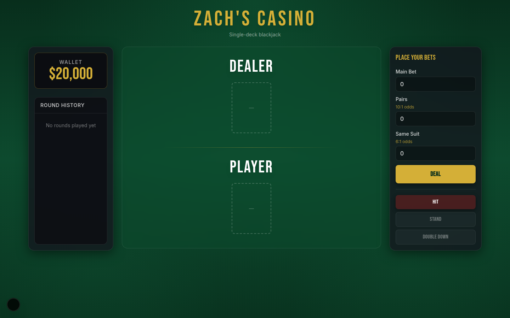
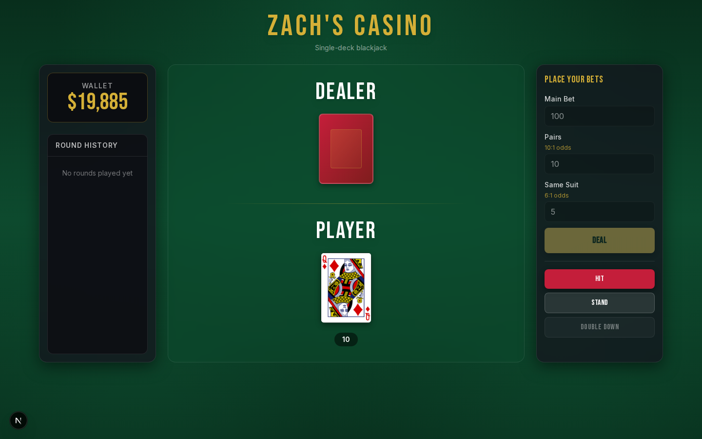
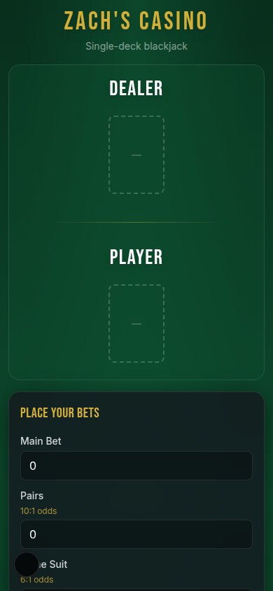
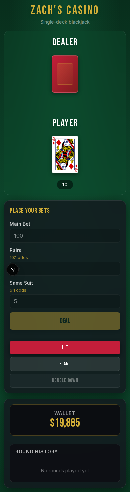

# Zach's Casino — Blackjack

A modern single-deck blackjack game built with Next.js, TypeScript, and Tailwind CSS.

## Features

- Player vs. dealer blackjack with standard rules (dealer stands on 17)
- Wallet system starting at $20,000
- Side bets: Pairs (10:1) and Same Suit (6:1)
- Double down support
- In-app toast notifications (no alert popups)
- Responsive layout for mobile, tablet, and desktop
- Round history tracking

## Tech Stack

- **Next.js 15** (App Router)
- **TypeScript**
- **Tailwind CSS**
- **Vitest** for unit tests
- [Deck of Cards API](https://deckofcardsapi.com/) (proxied via `/api/deck`)

## Getting Started

```bash
npm install
npm run dev
```

Open [http://localhost:3000](http://localhost:3000) in your browser.

## Scripts

| Command | Description |
|---------|-------------|
| `npm run dev` | Start development server |
| `npm run build` | Production build |
| `npm run start` | Start production server |
| `npm test` | Run unit tests |
| `npm run lint` | Run ESLint |

## Deployment

Recommended: deploy to [Vercel](https://vercel.com) for full Next.js support including API routes.

For GitHub Pages, add `output: 'export'` to `next.config.ts` and call the Deck of Cards API directly from the client.

## Project Structure

```
app/           # Next.js pages and API routes
components/    # React UI components
hooks/         # Game state hook
lib/game/      # Pure game logic (hand values, payouts, dealer rules)
lib/api/       # Deck API client
__tests__/     # Vitest unit tests
```

## Screenshots

### Desktop

| Initial state | After dealing |
|---|---|
|  |  |

### Mobile

| Initial state | After dealing |
|---|---|
|  |  |

## Bug Fixes from Original

- Unified ace-aware hand value calculation
- Fixed nested card array bug
- Fixed reshuffle race condition with async/await
- Fixed double down wallet deduction
- Added bet validation against wallet balance
- Replaced alert/setTimeout chains with state machine + toasts
